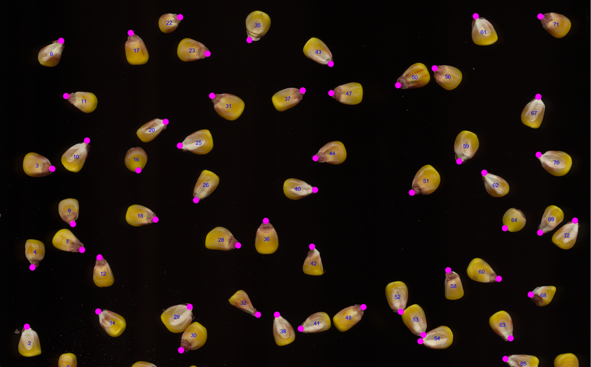
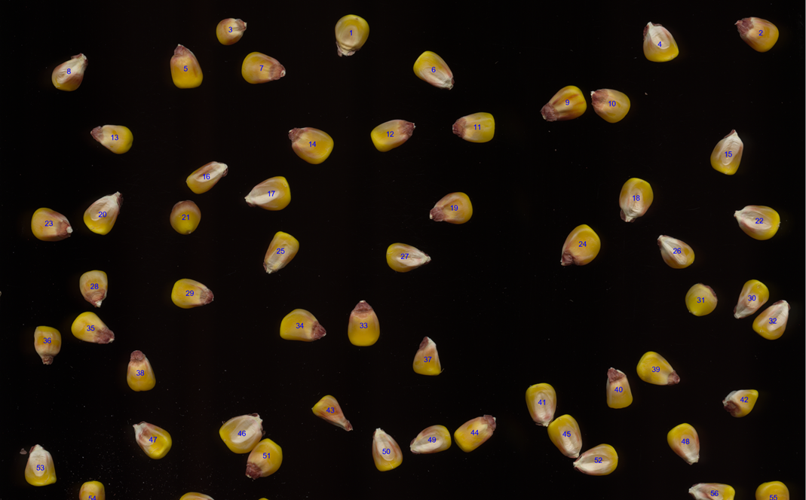
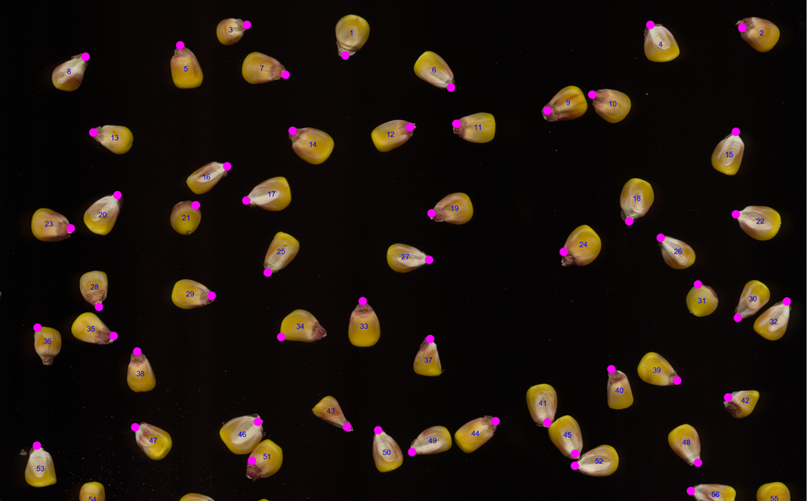
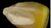

# Automated Corn Kernel Analysis

## Project Overview
An automated image processing system developed for the Department of Plant and Agroecosystem Sciences at UW-Madison to analyze corn kernel characteristics. This tool processes images of corn kernels to automatically:
- Count individual kernels
- Locate kernel centroids
- Detect kernel apexes
- Classify kernel types (red or white crowned)

## Background
Agricultural research often requires precise measurement of kernel characteristics across large sample sizes. Manual analysis is time-consuming and can introduce human error. This automated system provides consistent, rapid analysis of corn kernel images to support research in plant genetics and crop development.

## Results & Performance

| Metric | Value | Rank |
|--------|-------|------|
| Kernel Counting Error Rate | 1.4% | 19th |
| Avg Centroid Detection Error | 3.13 pixels | 6th |
| Avg Apex Detection Error | 15.21 pixels | 2nd |
| Classification Error Rate | 5.4% | 15.5th |
| **Final Score** | **94.382/100** | - |



## Methodology

### 1. Kernel Detection & Counting
The system uses a multi-step image processing pipeline:
1. Image preprocessing with Wiener filtering and binarization
2. Morphological operations to separate connected kernels
3. Component analysis for kernel counting

Key steps:
```mathematica
binImg = Binarize[img];
filteredImg = WienerFilter[binImg, 100];
fillImg = FillingTransform[filteredImg];
erodeImg = Opening[fillImg, DiskMatrix[20]];
```

### 2. Feature Extraction
#### Centroid Detection
- Uses component measurements to find center of mass
- Achieves accuracy within 3.13 pixels on average



#### Apex Detection
- Identifies the furthest point from centroid using convex hull analysis
- Average error of 15.21 pixels



### 3. Kernel Classification
The system classifies kernels into red or white crowned categories:




Classification process:
1. Template matching against reference kernels
2. Color channel analysis
3. Distance-based classification

Results visualization:


## Technical Implementation
- Written in Mathematica
- Key functions:
  - `cornCountNMR`: Kernel counting
  - `cornCentroidNMR`: Centroid detection
  - `cornApexNMR`: Apex detection
  - `cornRedOrWhiteNMR`: Kernel classification

## Requirements
- Mathematica 13.1
- Input images should be high-resolution TIF files
- Consistent lighting conditions for optimal performance

## Usage
1. Import image using standard Mathematica import:
```mathematica
img = Import["path/to/image.tif"]
```
2. Copy code contents from [cornProcessingCode.txt](https://github.com/nranabhat/corn-kernel-image-processing/blob/main/cornProcessingCode.txt) into a Mathematica notebook. 
   
3. Run analysis functions:
```mathematica
kernelCount = cornCountNMR[img]
centroids = cornCentroidNMR[img]
apexes = cornApexNMR[img]
classification = cornRedOrWhiteNMR[img]
```

## Acknowledgments
Developed for the Department of Plant and Agroecosystem Sciences at UW-Madison by Nico Ranabhat.
